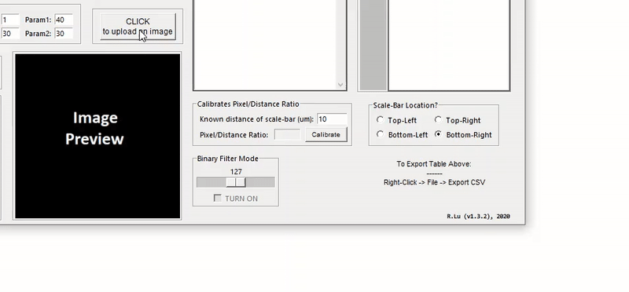
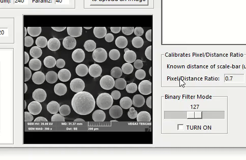
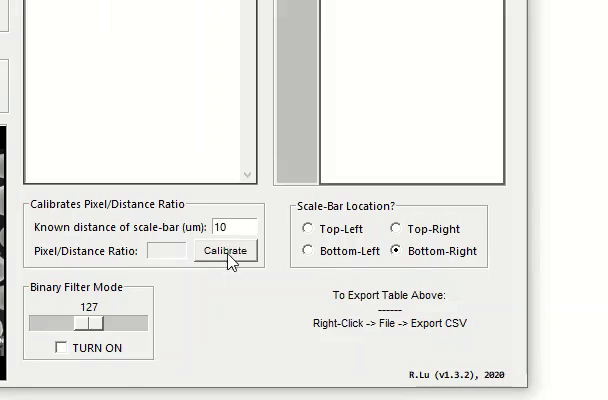
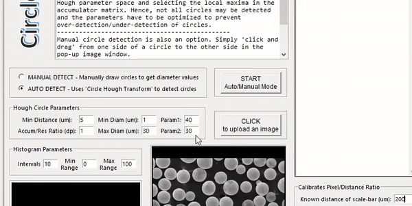
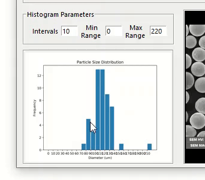

# CircleD Software

Please read the How-To-Use-Guide PDF file to get started.

All the features of the software are demo'ed below:

Upload and select images

Binary filter mode

Calibrating scale bar

Auto-Detection mode

Manual-Detection mode

Display results on histogram

Exporting data to CSV/spreadsheet file

